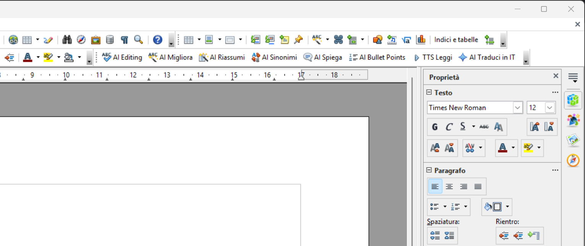
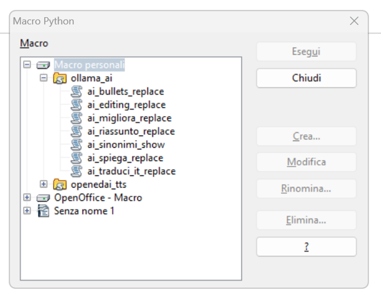

# 🧠 Ollama AI Macro for OpenOffice / LibreOffice
**Autore:** [MetaDarko](https://github.com/ShinRalexis)  
**Anno:** 2025  
---

## 📖 Introduzione

**Ollama AI** è una macro Python per **OpenOffice** e **LibreOffice Writer** che permette di connettere il tuo documento a un modello linguistico **Ollama locale** (ad esempio *Gemma 3, GPT-OSS, LLaMA 3, ecc.*).  
Puoi selezionare un testo e chiedere al modello di:
- Migliorarlo o correggerlo  
- Fare editing leggero  
- Riassumerlo  
- Tradurlo in italiano  
- Spiegarlo in modo semplice  
- Trasformarlo in elenco puntato  
- Trovare sinonimi e alternative espressive  

La macro non invia nulla online: comunica solo con il tuo **server Ollama locale** (es. `http://127.0.0.1:11434`).

---

## ⚙️ Installazione

### 1️⃣ Posizione del file

> Copia il file **`ollama_ai.py`** nel percorso esatto:
> ```
> C:\Users<tuo_nome>\AppData\Roaming\OpenOffice\4\user\Scripts\python
> ```

> 🔸 Su LibreOffice il percorso può essere:
> ```
> C:\Users\<tuo_nome>\AppData\Roaming\LibreOffice\4\user\Scripts\python
> ```

Se non esiste la cartella `python`, creala manualmente.

---

### 2️⃣ Riavvio

Dopo aver copiato il file:
- Chiudi completamente OpenOffice/LibreOffice  
- Riavvialo per caricare le nuove macro  

---

## 🧩 Come usare le macro

Apri **Writer** → vai su **Strumenti ▸ Macro ▸ Esegui macro...**

Ti troverai davanti a una finestra simile a questa:



Apri il ramo:
Macro personali > ollama_ai

Troverai i seguenti comandi:
ai_editing_replace
ai_migliora_replace
ai_riassunto_replace
ai_traduci_it_replace
ai_bullets_replace
ai_spiega_replace
ai_sinonimi_show

Seleziona uno di questi e premi **Esegui** per usarlo sul testo selezionato nel documento.

---

## 🖱️ Creare pulsanti personalizzati

Puoi aggiungere ogni macro come **pulsante nella barra degli strumenti**.

1. Vai su **Strumenti ▸ Personalizza...**  
2. Seleziona la scheda **Barra degli strumenti**  
3. In basso scegli “Aggiungi”  
4. Nella finestra che compare, cerca in **Categoria → Macro personali → ollama_ai**  
5. Scegli la macro che vuoi aggiungere (es. `ai_migliora_replace`)  
6. Premi **Aggiungi**, poi **OK**


> 💡 Puoi rinominare i pulsanti e scegliere un’icona diversa (es. quella di sistema “ABC” per le funzioni linguistiche).

---

## 🔧 Impostazioni del file

All’inizio dello script troverai la sezione `SETTINGS`:

```python
SETTINGS = {
    "host": "http://127.0.0.1:11434",
    "model": "gemma3:12b",
    "mode": "generate",
    "system_prompt": "Sei un assistente italiano: migliora la chiarezza dei testi mantenendone senso e tono.",
    "timeout": 180,
    "prepend_system_to_generate": False
}
```
Puoi modificare:

model → il nome del modello Ollama installato

system_prompt → il tono o ruolo dell’assistente

mode → “generate” o “chat”

timeout → tempo massimo di risposta

## 🧠 Elenco funzioni disponibili
| Macro | Funzione |
|:--------------------------|:--------------------------------------------|
| ai_migliora_replace | Migliora la forma e la fluidità del testo |
| ai_editing_replace | Corregge solo errori minori |
| ai_riassunto_replace | Riassume in poche frasi |
| ai_traduci_it_replace | Traduce in italiano |
| ai_bullets_replace | Converte in elenco puntato |
| ai_spiega_replace | Spiega in modo semplice |
| ai_sinonimi_show | Mostra sinonimi (popup, non modifica il testo) |

## 🚀 Esempio d’uso
Seleziona un paragrafo

Premi il pulsante “AI Migliora” (o avvia la macro corrispondente)

Attendi la risposta dal modello locale

Il testo verrà automaticamente sostituito con la versione migliorata

## ❗ Requisiti
Ollama installato e in esecuzione localmente
👉 https://ollama.ai

Almeno un modello compatibile (es. gemma3:12b, gpt-oss:20b, ecc.)

Python incluso in OpenOffice o LibreOffice

Accesso a Internet non necessario

## 🧩 Licenza
Questo progetto è rilasciato sotto licenza Apache 2.0.
Puoi modificarlo e ridistribuirlo liberamente, citando l’autore.

## 🐞 Segnalazione bug
Se trovi un problema o un comportamento anomalo, apri una Issue su GitHub oppure scrivimi:
👉 Segnala un bug o richiedi supporto

## 📦 Riepilogo
Tipo	Percorso / Azione
File principale	ollama_ai.py
Percorso installazione	C:\Users\<nome>\AppData\Roaming\OpenOffice\4\user\Scripts\python
Compatibilità	OpenOffice / LibreOffice
Linguaggio	Python (integrato)
Connessione	Locale (Ollama API)
Autore	MetaDarko

💡 Questo progetto nasce per rendere l’AI accessibile anche all’interno di OpenOffice, offrendo strumenti di scrittura intelligenti ma completamente offline.

